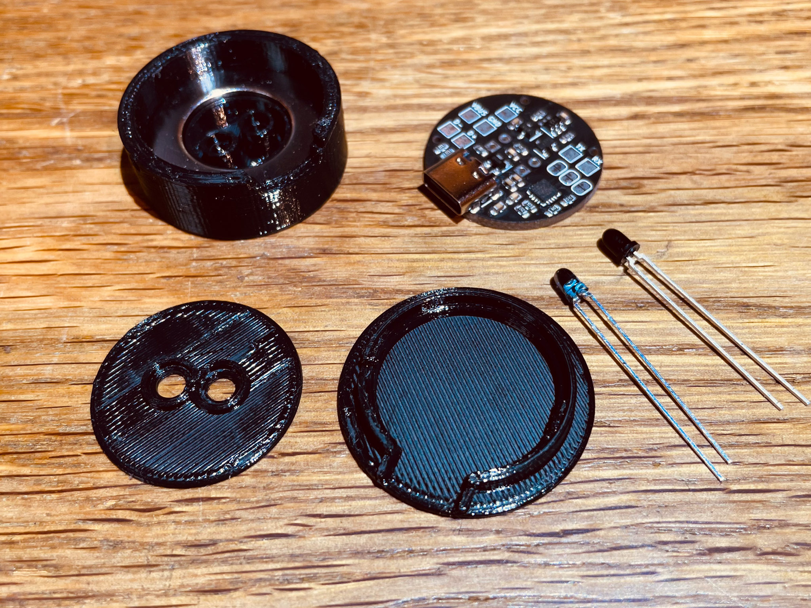
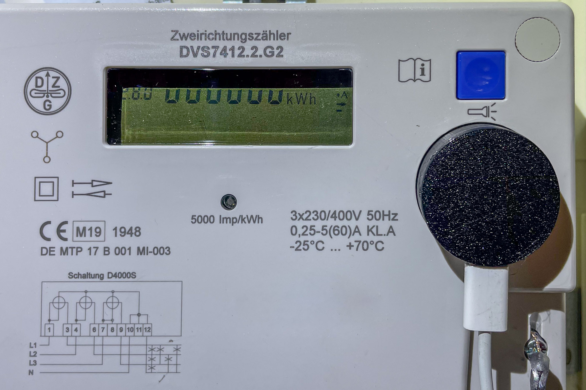

IEC-62056-21-Optical-Probe
===

Optical probe for reading out power meters supporting the [IEC 62056-21](https://www.ungelesen.net/protagWork/media/downloads/solar-steuerung/iec62056-21%7Bed1.0%7Den_.pdf) standard via USB.

Infrared part is based on https://wiki.volkszaehler.org/hardware/controllers/ir-schreib-lesekopf-ttl-ausgang.

### JLCPCB

PCBs can be ordered fully-assembled (besides the IR-LED and Photodiode) from [JLCPCB](https://jlcpcb.com/DDE). Required files are
[IEC-62056-21-Optical-Probe_cpl_jlc.csv](Gerber/IEC-62056-21-Optical-Probe_cpl_jlc.csv), [IEC-62056-21-Optical-Probe_bom_jlc.csv](Gerber/IEC-62056-21-Optical-Probe_bom_jlc.csv) and
[IEC-62056-21-Optical-Probe.zip](IEC-62056-21-Optical-Probe.zip).

## License

[![CC BY-SA 4.0][cc-by-sa-shield]][cc-by-sa]

This work is licensed under a [Creative Commons Attribution-NonCommercial-ShareAlike 4.0 International License][cc-by-sa].

[![CC BY-SA 4.0][cc-by-sa-image]][cc-by-sa]

[cc-by-sa]: http://creativecommons.org/licenses/by-nc-sa/4.0/
[cc-by-sa-image]: https://licensebuttons.net/l/by-nc-sa/4.0/88x31.png
[cc-by-sa-shield]: https://img.shields.io/badge/License-CC%20BY--NC--SA%204.0-lightgrey.svg

